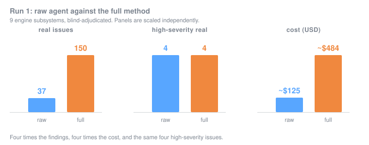

# pdd-experiment-cave

Does PDD show a real, defensible advantage over a strong raw agent on a large brownfield
codebase? This project runs that experiment on the Cave engine and records every finding and
every action.

Status: run 1 is in for arms R and P, blind-adjudicated. Arm C has not started, runs 2 and 3
are pending, and the kill-condition has not been evaluated. Headline numbers under
[Run status](#run-status); nothing here is a final result.

## Navigate

- [plan.md](plan.md) — the design: the question, three arms (R raw, C chunk-only, P full
  PDD), the wide deterministic gate suite, scope, budget, metrics, results schema,
  kill-condition, and protocol.
- [prompts/](prompts/) — frozen finder and judge prompts: `raw.md` (shared by R and C),
  `judge.md`, `pdd.md`.
- [view/](view/) — the dod dashboard: [dod.project.json](dod.project.json) manifest, the atom
  spec in [view/render-spec.sample.json](view/render-spec.sample.json), the contract in
  [view/README.md](view/README.md).
- [results/](results/) — per-cell records, written as the run proceeds: `findings/` (raw and
  adjudicated, per arm), `adjudication/` (judge input and verdicts, per subsystem),
  `gates/` (mutation and static gate samples with their triage), and `experiment.json` /
  `target.json` pinning commits, prompt hashes and the target region.
- `metrics.json` — derived from results, written by the run.
- [calibration/](calibration/) — the budget read that sizes the run against the 20 percent
  weekly headroom.
- `events.jsonl` — the append-only action ledger.

## How everything is recorded

Three layers, so no finding and no action is lost:

1. **Git history.** Every step is a small commit; the log is the durable, searchable record.
2. **`events.jsonl`.** One line per action: `{ ts, actor, action, target, note }`,
   append-only. Append with `./log-event <actor> <action> <target> <note>`.
3. **`results/`.** Every finding is a durable object with full provenance: arm, run, blind
   verdict, judge severity and class, oracle match.

The dod dashboard renders all three, including a live view of the event stream.

## Run status

Scope of run 1: the target region, meaning 9 engine subsystems with the compiler and linker
excluded. Blind-adjudicated by `prompts/judge.md`.

| Stage | Status |
|---|---|
| Arm R (raw), run 1 | done, blind-adjudicated |
| Arm P (full PDD), run 1 | done, blind-adjudicated |
| Arm C (chunk-only) | not started |
| Runs 2 and 3, all arms | pending |
| Gate suite (wide) | extracted |
| Gate triage, mutation sample (n=385) | done |
| Static-gate validation (n=58) | done |
| Overlap R vs P | pending |
| Metrics + kill-condition | pending |

### Run 1 headline

**[Explore the full dashboard](https://alextavor.github.io/pdd-experiment-cave/)**: all 20
panels, no install.

| Metric | R (raw) | P (full PDD) |
|---|---|---|
| real issues | 37 | 150 |
| false positives | 1 | 5 |
| trivial | 0 | 27 |
| precision (real / decided) | 97% | 97% |
| high-severity real | 4 | 4 |
| production cost (USD est) | ~$125 | ~$484 |
| cost / real issue | ~$3.4 | ~$3.2 |

Two run-1 results that do not flatter PDD, stated here rather than left in `metrics.json`:
**P found the same four high-severity issues as R** while costing 3.9x, and the
`cover-the-mirror` static gate returned **0 real findings out of 36**, which is noise and
should be filtered out of the suite.

### Where the signal actually came from

The deterministic gate layer is where the gap is widest, and this table is the result the whole
experiment turns on. Every source, by how much real work it produced and at what precision:

| Source | Raw | Real / killable | Signal |
|---|---:|---:|---:|
| mutation gate | 7,227 | ~6,782 | 93% |
| R raw agent (baseline) | 38 | 37 | 97% |
| P atlas: risk | 77 | 63 | 82% |
| P atlas: footgun | 65 | 55 | 85% |
| P atlas: silent-failure | 40 | 32 | 80% |
| static: boundary-tests | 10 | 6 | 60% |
| static: silent-failure | 5 | 3 | 60% |
| static: no-op-paths | 3 | 1 | 33% |
| static: pin-values | 4 | **0** | **0%** |
| static: cover-the-mirror | 36 | **0** | **0%** |

One cheap deterministic gate produced roughly 6,782 real items at 93% precision. Every finder
in both arms combined produced 15 test-adequacy gaps. Two static gates produced nothing at all
across 40 findings and should be cut from the suite. The killable figure is an estimate from a
stratified sample of 385 with a 95% interval of 6,608 to 6,956.

The dod dashboard renders the grid, the head-to-head and the event stream live. The full
status grid is in [plan.md](plan.md).

## Reuse

[MIT](LICENSE), code and data alike. The results are here to be argued with, so re-running the
protocol against your own target, or disputing an adjudication, is the point. Prompts are
frozen in `prompts/` and commits are pinned in `results/experiment.json`, which is what makes
run 1 reproducible.

